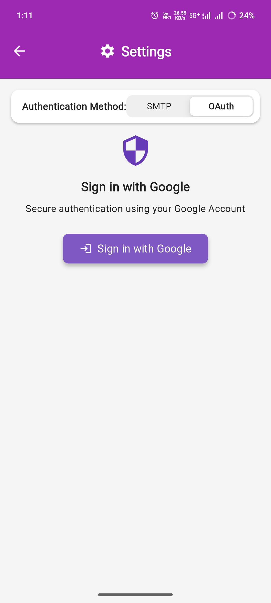
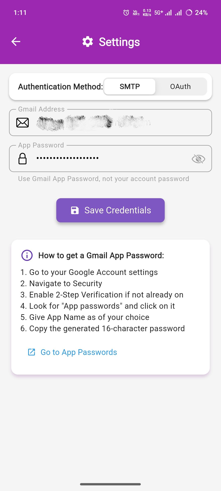
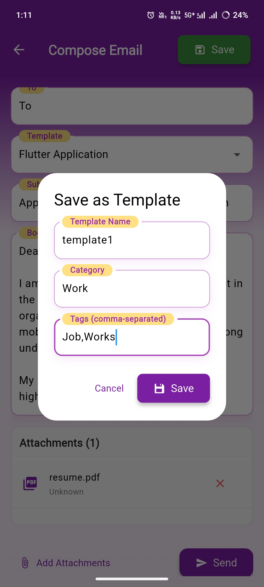
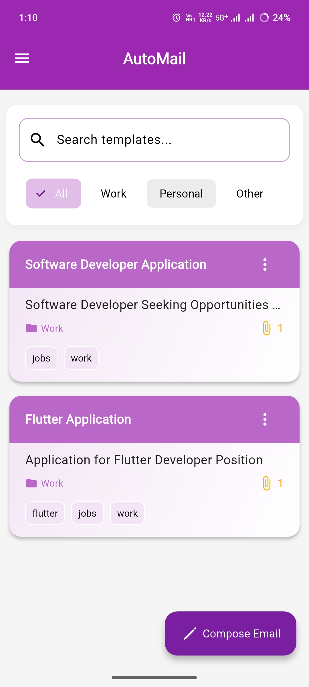

📧 AutoMail
===========

**A Flutter Application for Crafting & Managing Reusable Email Templates**

  
  

Never write repetitive emails again! AutoMail streamlines your workflow by letting you create, organize, and send templated emails with attachments – directly from your mobile device or via SMTP.

* * *

✨ Features
----------

### 📝 Template Creation

*   **Rich Content Templates**  
    Save pre-defined combinations of:
    
    *   Customizable email subjects
        
    *   Formatted body content
        
    *   Multiple file attachments
        
    *   Category-based organization
        
    *   Searchable tags
        

### ⚡ Smart Integration

*   **One-Click Email Launch**  
    Instantly open your email client with selected templates from anywhere on your device
    
*   **Direct SMTP Sending**  
    Send emails programmatically without leaving the app (configure your SMTP server)
    

### ☁️ Cloud Sync

*   **Secure Cloud Storage**  
    Templates are safely stored in the cloud (Firebase) for cross-device access
    
*   **Offline Access**  
    Recently used templates available without internet connection
    

### 🔍 Organization

*   **Dynamic Categorization**  
    Organize templates with custom categories (e.g., "Sales", "Support")
    
*   **Tagging System**  
    Add multiple tags for quick search (#invoice, #follow-up, #marketing)
    

* * *

📸 Preview
----------

# Email Template Manager Guide

## 1. Authentication Setup
  
*OAuth 2.0 authentication screen for API integrations*

  
*SMTP server configuration for direct email delivery*

## 2. Template Management
  
*Template editor interface with rich text formatting options*

## 3. Dashboard Overview
  
*Main dashboard showing recent templates and quick actions*

* * *

**Key Features:**
- Template editor with WYSIWYG interface
- Multiple authentication methods
- Category-based template organization
- One-click email sending
- Template version history
* * *

📥 Installation
---------------

### Direct Download

`git clone https://github.com/Akshayp001/automail.git`

`cd automail`

`flutter pub get`

`flutter run`

* * *

🚀 Usage
--------

1.  **Create Template**
    
    *   Tap "+" to start new template
        
    *   Add subject/body/attachments
        
    *   Assign category and tags
        
    *   Save to local device or cloud
        
2.  **Send Email**
    
    *   Browse templates by category/tags
        
    *   Tap desired template → "Send Now"
        
    *   Choose:  
        a) Open email client with pre-filled content  
        b) Send directly via SMTP (configure in settings)
        
3.  **Manage Templates**
    
    *   Swipe left to edit/delete
        
    *   Use search bar for quick access
        
    *   Export templates as JSON for backup
        

* * *

🛠 Technology Stack
-------------------

*   **Frontend**: Flutter (Dart)
    
*   **Backend**: Firebase Cloud Firestore
    
*   **Email Services**: SMTP (via mailer package)
    
*   **State Management**: Getx
    
*   **Local Storage**: Shared Prefs
    
*   **File Picker**: flutter\_file\_picker
    

* * *

🤝 Contributing
---------------

We welcome contributions! Please follow these steps:

1.  Fork the repository
    
2.  Create your feature branch (`git checkout -b feature/amazing-feature`)
    
3.  Commit your changes (`git commit -m 'Add some amazing feature'`)
    
4.  Push to the branch (`git push origin feature/amazing-feature`)
    
5.  Open a Pull Request
    

* * *

📄 License
----------

This project is licensed under the MIT License - see the [LICENSE](LICENSE) file for details.

* * *

**Crafted with ❤️ by Akshayp001**  
_Need help? Open an issue or reach out at [akshaypp7001@gmail.com](mailto:akshaypp7001@gmail.com)_

